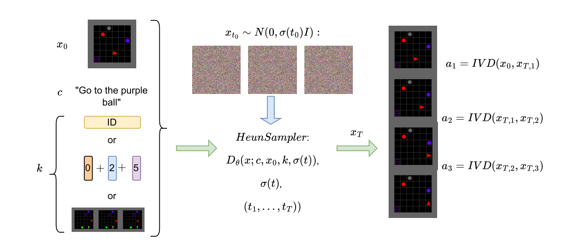

# Making Universal Policies Universal
[](https://pre-commit.com/)
[](https://github.com/psf/black)

Code for the paper ["Making universal policies universal"](https://arxiv.org/abs/2502.14777).

see also [Project Page](https://nikehop.github.io/making_universal_policies_universal/).



## Prerequisites & Dependencies


All of the logging is done via [WandB](https://wandb.ai/site/).

Create a new [conda](https://docs.anaconda.com/miniconda/) environment and install the dependecies:

```
conda create -n universal_policies python=3.11
conda activate universal_policies
pip install -e . 
```

## Run Experiments 

### Generate Demonstrations 

The code to generate demonstrations can be found in the `./universal_policies/environments/babyai` folder all following commands should be run from there. To generate the demonstration datasets for the different environments and different actions spaces, run:

```
python generate_demos.py --config ./configs/CONFIG_FILE --action_space 0
```


Here `CONFIG_FILE` should be one of:
- `goto.yaml`; agent needs to go to the object; see [here](https://minigrid.farama.org/environments/babyai/GoToObj/)
- `goto_distractor.yaml`; agent needs to go to an object with distractors present; see [here](https://minigrid.farama.org/environments/babyai/GoToLocal/)
- `goto_distractor_large.yaml`; agent needs to go to an object with distractors present navigating through nine rooms; see [here](https://minigrid.farama.org/environments/babyai/GoTo/)

The available action spaces are:

- 0: standard 
- 1: no left-turns
- 2: no right-turns
- 3: diagonal, additional to the standard actions move forward diagonally
- 4: wsad, move to the left, right, up, down and if pointing to another direction turn at the same time
- 5: dir8, move to any diagonal fields and turn right
- 6: left-right, move left and right and turn right
- 7: all-diagonal, all diagonal cells + turn right

If the agent should be coloured differntly depending on the action space used, set the `use_agent_type` argument in the config-file to True. 

The resulting pickle file contains a list of tuples and will be stored in a folder with the following naming convention: `{action_space}_{n_episodes}_{min_length}_{num_distractors}_{use_agent_type}_demos`. Each tuple corresponds to an episode. The tuple contains the following values:

- instruction `str`
- environment name: `str`
- obs_sequence: `blosc.array`
- directions: `list[int]`
- actions: `list[int]`
- rewards: `list[floats]`
- action_space: `int`

To generate the dataset for all action spaces and pool all datasets from the in-distribution agents (0-5) to create the mixture dataset run:

```
bash ./scripts/data_generation.sh` ./configs/CONFIG.yaml
```

The data for the GOTO environment is already part of the repository (see `./data`).

To create example trajectories of each agent type that the diffusion planner can be conditioned on run: 

```
python generate_examples.py --config ./configs/generate_examples.yaml`.
```

The type of examples to be generated can be specified in the config file. Running the command will create a .pkl file in `./data/EXAMPLES` that contains a dictionary mapping the action-space ID to a list of examples the planner can be conditioned on. 
The file follows the following naming convention `{env}_{n_examples}_{n_distractors}_{example_type}.pkl`.

### Train Inverse Dynamics Models 

The code for the inverse dynamics models can be found in `./universal_policies/ivd_model`. All the following commands should be run from there. To train an inverse dynamics model for a given action space on a specific dataset run:

```
python train.py --config ./configs/ivd.yaml --datapath ../../data/GOTO/standard_83_4_0_False_demos/dataset_83.pkl --action_space 0
```

To train an ivd for all available action spaces in an instance of the BabyAI environment, add the corresponding datapaths to the script `./scripts/train_ivds.sh` and run:

```
bash ./scripts/train_ivds.sh
```

### Train the Diffusion Planner 

The code to train the diffusion planner can be found in `./universal_policies/diffusion_model`. All the following commands should be run from there. To train a diffusion planner for action space 0 in the GOTO environment run: 

```
python train.py --config ./configs/goto.yaml --datapath ../../data/GOTO/standard_83_4_0_False_demos/dataset_83.pkl --action_space 0
```
After training the planner will be evaluated over 512 episodes in the corresponding environment. For that the IVD-models for the action space must exist and the path to the IVD must be specified in `ivd_goto.yaml`. To obtain pretrained IVDs see [here](#trained-models) or to train them from scratch see [here](#train-inverse-dynamics-models)

To train a diffusion planner for each action space separately in the GOTO environment run:

```
bash ./scripts/train_all_action_spaces.sh
```

By changing the config file we can train the following variations of the diffusion planner:

- mixed_goto.yaml; train on mixed dataset.
- mixed_agentid.yaml; train on mixed dataset and condition on agentid.
- mixed_action_space.yaml; train on mixed dataset and condition on action space encoding.
- mixed_example.yaml; train on mixed dataset and condition on examples.
- goto_distractor.yaml; train on standard dataset in GoTo-Distractors environment and condition on agentid.
- goto_distractor_large.yaml; train on standard dataset in GoTo-Distractors-Large environment and condition on agentid.


### Evaluate via the Diffusion Agent

The code to evaluate the diffusion planner can be found in `./universal_policies/diffuser_agent`. All the following commands should be run from there. To evaluate a trained diffusion planner in the GOTO environment with action space 0 run:

```
python eval.py --config ./configs/goto.yaml --checkpoint CHECKPOINT_PATH --action_space 0
```

To evaluate a trained diffusion planner in the GOTO environment for all action spaces run:

```
bash ./scripts/eval_all_action_spaces.sh CHECKPOINT_PATH
```

### Train Imitation Learning Policies

The code to train the imitation learning policies can be found in `./universal_policies/imitation_learning`. All the following commands should be run from there. To train the imitation learning baselines on a specific dataset for a specific action space run 

```
python train.py --config ./configs/instruction_imitation_goto.yaml --datapath "../../data/GOTO/standard_83_4_0_False_demos/dataset_83.pkl" --action_space 0
```

After training the model is evaluated over 512 episodes in the corresponding environment. To train the IL baseline for all action spaces run:

```
bash ./scripts/train_il_all_action_spaces.sh
```

To run the imitation learning baselines that can handle multiple action spaces use the following config files:
- `agent_heads_goto.yaml` ("IL - Agent Head")
- `complete_action_space_goto.yaml` ("IL - Union of Action Spaces").


### Evaluate Imitation Learning Policies

To evaluate policies in the GOTO environment that work for multiple agents (IL - Agent Head, IL - Union of Action Spaces) on all action space (0-7) run:

```
bash eval_all_action_spaces.sh PATH_TO_CHECKPOINT
```

Changes to the evaluation can be made in the corresponding config files (`eval_instruction_imitation_goto.yaml`,`eval_instruction_imitation_goto_distractors.yaml`).


## Train & Evaluate Multi-Step Planners

* 1. Train a planner that plans for $n$-timesteps at each planning step, by setting the `step_frequency` parameter to $n$ in the corresponding diffusion model config. 

* 2. Train a goal-conditioned imitation learning policy by running from the `universal_policies/imitation_learning` learning directory with the corresponding parameters:

```
python train.py --config ./configs/obs_imitation_goto.yaml --datapath "../../data/GOTO/standard_83_4_0_False_demos/dataset_83.pkl" --action_space 0
```

* 3. To evaluate the multi-step planner run from the `universal_policies/diffuser_agent` directory:

```
python eval.py --config ./configs/multi_step_planner.yaml --checkpoint PATH_TO_DIFFUSION_PLANNER --policy_checkpoint PATH_TO_GOAL_COND_POLICY --n_timesteps n
```


## Trained Models 

We make the trained inverse dynamics models, imitation learning baselines and diffusion planners for a single random seed in the GOTO environment available [here](https://drive.google.com/file/d/1aX9sYjRN3iFYyGr9mHpo41plymyy1qnt/view?usp=drive_link).

To use the trained IVD models of the GOTO environment, put the downloaded zip into the `./model_store` folder and unzip it:

```
unzip -r UniversalPoliciesModels.zip UniversalPoliciesModels
```
## Acknowledgements 

The code uses code elements from the following repositories:

- [https://github.com/labmlai/annotated_deep_learning_paper_implementations](https://github.com/labmlai/annotated_deep_learning_paper_implementations) (MIT License)
- [https://github.com/NVlabs/edm](https://github.com/NVlabs/edm) (CC BY-NC-SA 4.0)
- [https://github.com/mila-iqia/babyai](https://github.com/mila-iqia/babyai) (BSD 3-Clause License)


The licenses and copyright notices can be found in the respective code files.
